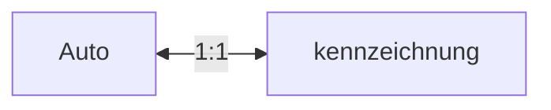

---
{"dg-publish":true,"permalink":"/02-resources/notes/1-zu-1/","tags":["datenbank/kardinatität"],"noteIcon":"","updated":"2025-07-12T13:31:41.000+02:00"}
---

> 1 zu 1 | 1:1
> Etwas gehört nur zu etwas und diese etwas gehört nur zu dieser Etwas.

