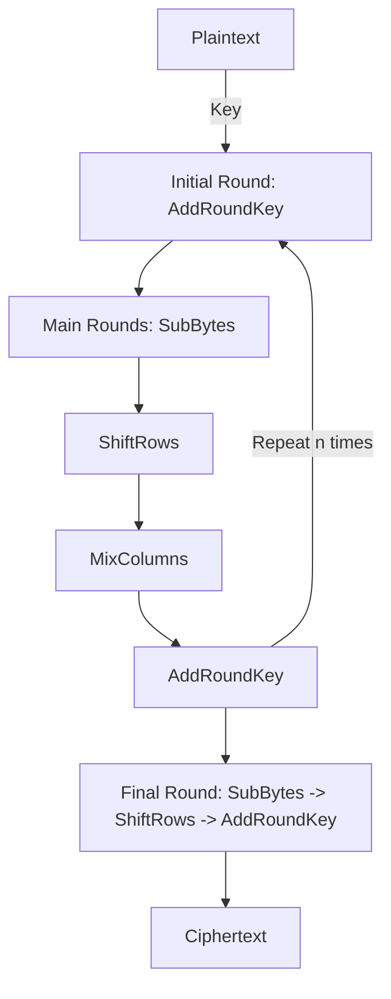

---
{"dg-publish":true,"permalink":"/02-resources/notes/aes/","tags":["kryptografie"],"noteIcon":"","updated":"2025-03-18T13:40:36.000+01:00"}
---

>Es ist ein [[02 - RESOURCES/Notes/Symmetrische Verschlüsselung\|Symmetrische Verschlüsselung]]salgorithmus, der Daten in Blöcken verschlüsselt und dabei den gleichen Schlüssel für [[02 - RESOURCES/Notes/Verschlüsselung\|Verschlüsselung]] und Entschlüsselung verwendet.
>> AES wurde von der US-Regierung als Standard für sichere Datenübertragung festgelegt und nutzt Blockgrößen von 128 [[02 - RESOURCES/Notes/Bit\|Bit]] mit Schlüssellängen von 128, 192 oder 256 [[02 - RESOURCES/Notes/Bit\|Bit]].  
>> Durch seine hohe Sicherheit und Effizienz ist AES weit verbreitet und wird sowohl für private als auch für staatliche Verschlüsselungsanwendungen verwendet.  
>> AES arbeitet in mehreren Runden (abhängig von der Schlüssellänge) und nutzt Substitution, Permutation und Schlüsseladdition.

>Die Anzahl der Runden beträgt 10 bei 128 [[02 - RESOURCES/Notes/Bit\|Bit]], 12 bei 192 [[02 - RESOURCES/Notes/Bit\|Bit]] und 14 bei 256 [[02 - RESOURCES/Notes/Bit\|Bit]] Schlüssellänge.