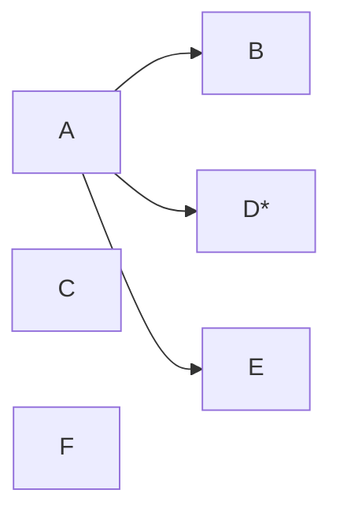

---
{"dg-publish":true,"permalink":"/02-resources/notes/anycast/","tags":["netzwerk"],"noteIcon":"","updated":"2024-07-04T11:38:16.686+02:00"}
---

> Ein Sender adressiert einen unbestimmten Empfänger einer bestimmte Empfänger einer bestimmten Gruppe.

