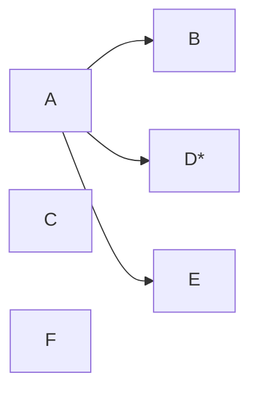

---
tags:
  - netzwerk
dg-publish: true
links: 
path: Notes
created: 2024-07-02 11:39
---
> Ein Sender adressiert einen unbestimmten Empfänger einer bestimmte Empfänger einer bestimmten Gruppe.

```mermaid
graph LR
A --> B
C
A --> D*
A --> E
F
```
