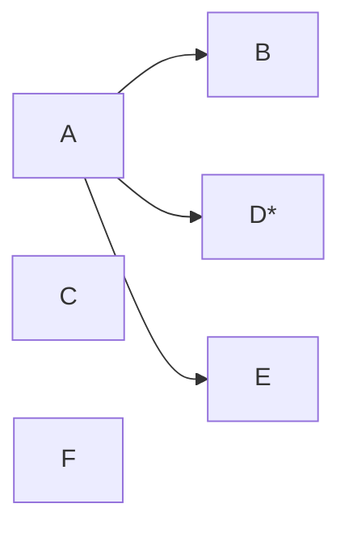

---
{"dg-publish":true,"permalink":"/02-resources/notes/anycast/","tags":["netzwerk"],"noteIcon":"","updated":"2025-07-12T13:31:41.287+02:00"}
---

> Ein Sender adressiert einen unbestimmten Empfänger einer bestimmte Empfänger einer bestimmten Gruppe.

