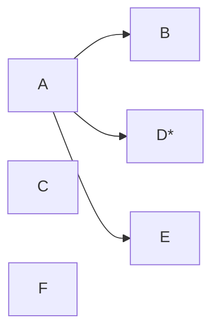

---
{"dg-publish":true,"permalink":"/02-resources/notes/anycast/","tags":["netzwerk"],"noteIcon":"","updated":"2025-09-05T10:12:28.141+02:00"}
---

> Ein Sender adressiert einen unbestimmten Empfänger einer bestimmte Empfänger einer bestimmten Gruppe.

