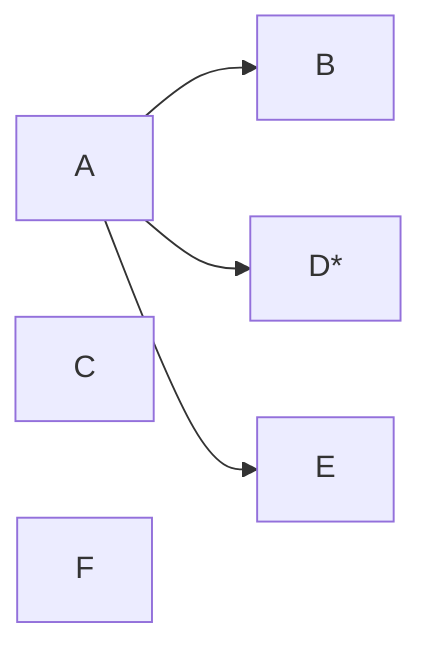

---
{"dg-publish":true,"permalink":"/02-resources/notes/anycast/","tags":["informatik/netzwerk"],"noteIcon":"","updated":"2025-10-29T12:59:02.299+01:00"}
---

> Ein Sender adressiert einen unbestimmten Empfänger einer bestimmte Empfänger einer bestimmten Gruppe.

