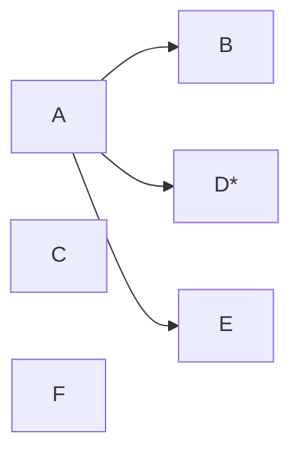

---
{"dg-publish":true,"permalink":"/02-resources/notes/anycast/","tags":["informatik/netzwerk"],"noteIcon":"","updated":"2025-10-29T12:59:02.000+01:00","dg-note-properties":{"created":"2024-07-02 11:39","links":null,"path":"Notes","tags":["informatik/netzwerk"]}}
---

> Ein Sender adressiert einen unbestimmten Empfänger einer bestimmte Empfänger einer bestimmten Gruppe.

```mermaid
graph LR
A --> B
C
A --> D*
A --> E
F
```
