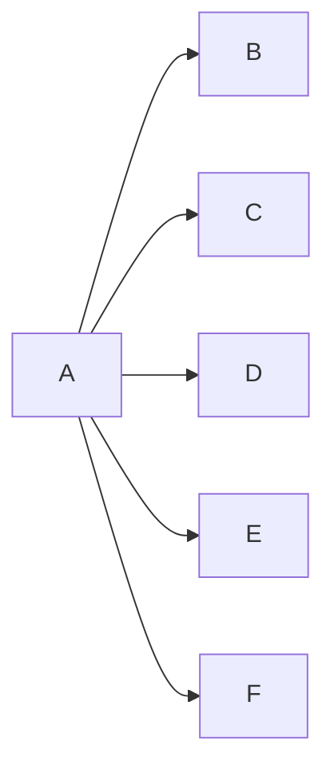

---
{"dg-publish":true,"permalink":"/02-resources/notes/broadcast/","tags":["netzwerk"],"noteIcon":"","updated":"2025-09-05T10:12:28.521+02:00"}
---

> Ein Sender adressiert alle Empfänger in die Netzwerk.
