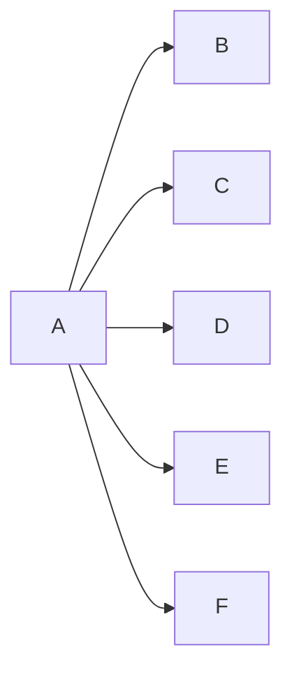

---
{"dg-publish":true,"permalink":"/02-resources/notes/broadcast/","tags":["informatik/netzwerk"],"noteIcon":"","updated":"2025-09-10T16:35:09.000+02:00"}
---

> Ein Sender adressiert alle Empfänger in die Netzwerk.
