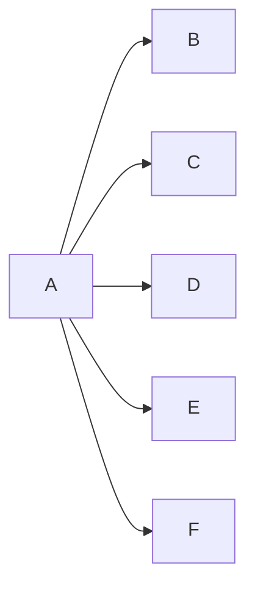

---
{"dg-publish":true,"permalink":"/02-resources/notes/broadcast/","tags":["informatik/netzwerk"],"noteIcon":"","updated":"2025-10-29T18:59:04.000+07:00","dg-note-properties":{"created":"2024-07-02 11:35","links":null,"path":"Notes","tags":["informatik/netzwerk"]}}
---

> Ein Sender adressiert alle Empfänger in die Netzwerk.

```mermaid
graph LR
A --> B
A --> C
A --> D
A --> E
A --> F
```