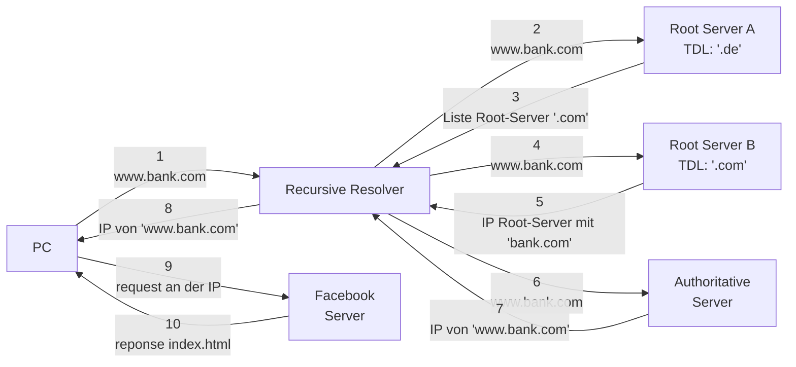

---
{"dg-publish":true,"permalink":"/02 - RESOURCES/Notes/DNS/","tags":["netzwerk/dns"],"noteIcon":"","updated":"2024-10-17T20:37:28.402+02:00"}
---

> [[02 - RESOURCES/Notes/Domain\|Domain]] Name System

Wenn wir beispielsweise eine URL in unseren Browser eingeben, wie zum Beispiel [www.haus-meyer.bank.com](http://www.haus-meyer.bank.com), werden wir direkt zur Website der Bank Haus Meyer weitergeleitet. Der Prozess, der das möglich macht, ist jedoch nicht so simpel, wie es scheint.

Um zu verstehen, was hinter den Kulissen passiert, musst du wissen, was [[02 - RESOURCES/Notes/Domain\|Domain]] Name Server (DNS) sind und wie der gesamte Ablauf von Anfragen (Requests) und Antworten (Responses) funktioniert.

<mark style="background: #BBFABBA6;">haus-meyer</mark>.<mark style="background: #FFF3A3A6;">bank</mark>.<mark style="background: #FF5582A6;">com</mark>

<mark style="background: #BBFABBA6;">[[02 - RESOURCES/Notes/Subdomain\|Subdomain]]</mark>
<mark style="background: #FFF3A3A6;">[[02 - RESOURCES/Notes/Domain\|Domain]]</mark>
<mark style="background: #FF5582A6;">[[02 - RESOURCES/Notes/TLD\|TLD]]</mark>

{ #1245f6}

Wie du es sehen kannst macht der Recursive Resolver die ganze Arbeit. Um das alles schneller zu machen wurde das [[02 - RESOURCES/Notes/TTL Cache\|TTL Cache]] zwischen die  Root Servers und den Recursive Resolver eingefügt.

### Beispiel 
Um das besser zu verstehen. Lass uns den Website [uol](https://www.uol.com.br/)  (https://www.uol.com.br/)besuchen. So läuft es ab:
>[!summary] 
>- Mein Browser schickt ein Request an der Resolver in Frankfurt
> - Diese schickt eine request an den Root-Server(am nähst) mit den Endung '.br' 
> - Es kriegt zurück eine Liste mit allen Root-Servers die '.br' [[02 - RESOURCES/Notes/TLD\|TLD]] haben 
> - Der Resolver schickt erneut eine Request , aber dieses mal an der Authoritative Server und diese schickt der [[02 - RESOURCES/Notes/IP\|02 - RESOURCES/Notes/IP]] von uol zurück 
> - Sobald der Recursive Resolver das enthält schickt es an mein Browser zurück 
> - mein Browser jetzt muss nur ein Request an diese [[02 - RESOURCES/Notes/IP\|02 - RESOURCES/Notes/IP]] schicken und auf den Response warten