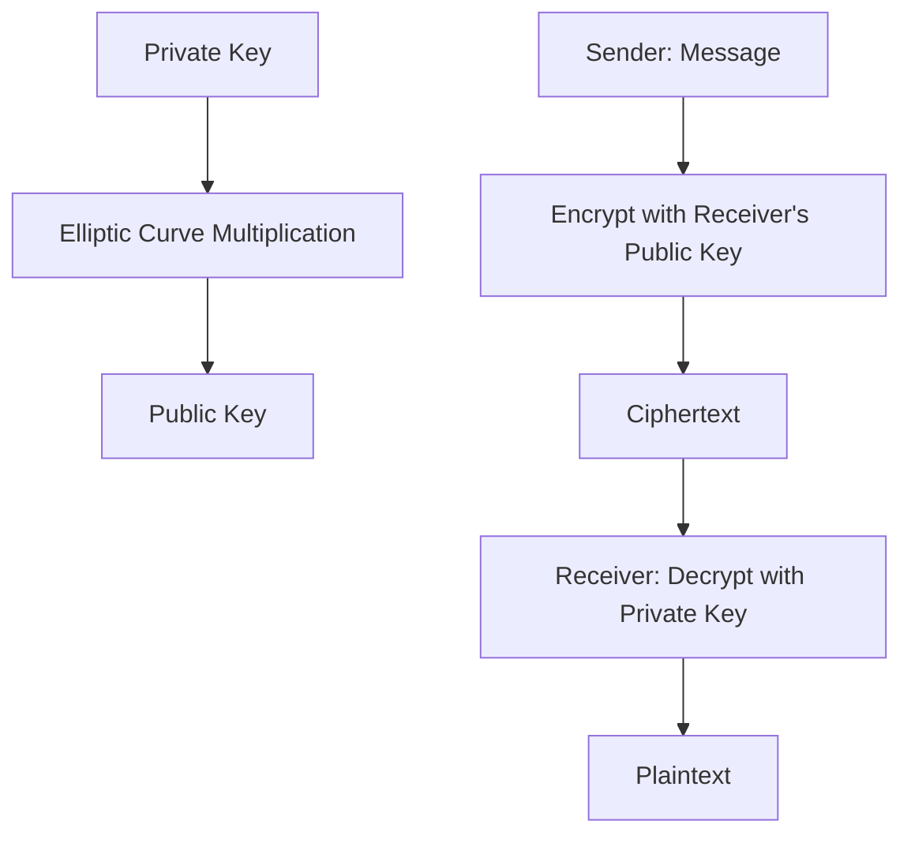

---
{"dg-publish":true,"permalink":"/02-resources/notes/ecc/","tags":["kryptografie","GFN/prüfungsrelevant/AP1/vorbereitung"],"noteIcon":"","updated":"2025-08-26T16:35:03.000+02:00"}
---

>Es ist ein Asymmetrische Verschlüsselungsverfahren, das auf der [[02 - RESOURCES/Notes/Mathe\|Mathematik]] elliptischer Kurven basiert.

> > ECC bietet bei kürzeren Schlüsseln eine vergleichbare Sicherheit wie andere Verfahren (z. B. [[02 - RESOURCES/Notes/RSA\|RSA]]), ist dabei jedoch ressourcenschonender.  
> > Wird häufig in mobilen Geräten, SSL/TLS und modernen Verschlüsselungsprotokollen eingesetzt.

**Vorteile von ECC:**

- Kürzere Schlüssel bei gleicher Sicherheit wie z. B. [[02 - RESOURCES/Notes/RSA\|[[R]]SA]]
- Schneller bei [[02 - RESOURCES/Notes/Verschlüsselung\|Verschlüsselung]] und Entschlüsselung
- Geringerer Ressourcenverbrauch (z. B. CPU, Speicher)

**Nachteile von ECC:**

- Komplexere Implementierung
- Anfälliger für Implementierungsfehler
- Lizenzprobleme bei manchen Kurven (z. B. vor NIST P-256)
