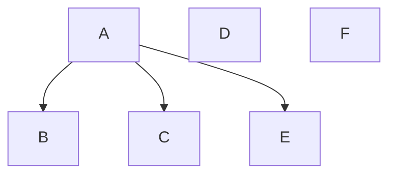

---
{"dg-publish":true,"permalink":"/02-resources/notes/multicast/","tags":["informatik/netzwerk"],"noteIcon":"","updated":"2025-09-10T16:35:27.543+02:00"}
---

> Ein Sender adressiert eine Menge (Gruppe)
> an Empfänger.

