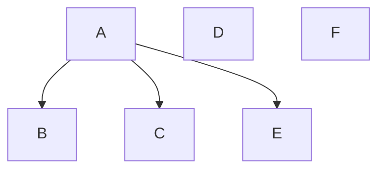

---
{"dg-publish":true,"permalink":"/02-resources/notes/multicast/","tags":["netzwerk"],"noteIcon":"","updated":"2025-09-05T10:12:30.000+02:00"}
---

> Ein Sender adressiert eine Menge (Gruppe)
> an Empfänger.

