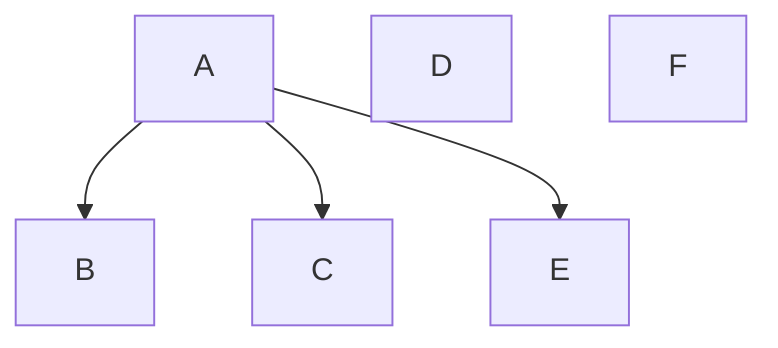

---
{"dg-publish":true,"permalink":"/02-resources/notes/multicast/","tags":["informatik/netzwerk"],"noteIcon":"","updated":"2025-10-29T12:59:08.000+01:00","dg-note-properties":{"created":"2024-07-02 11:25","links":null,"path":"Notes","tags":["informatik/netzwerk"]}}
---

> Ein Sender adressiert eine Menge (Gruppe)
> an Empfänger.

```mermaid
graph TD
A --> B
A --> C
D
A --> E
F
```
