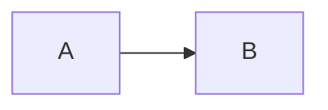

---
{"dg-publish":true,"permalink":"/02-resources/notes/unicast/","tags":["informatik/netzwerk"],"noteIcon":"","updated":"2025-09-10T16:35:39.649+02:00"}
---

> Ein Sender adressiert einen Empfänger. 

