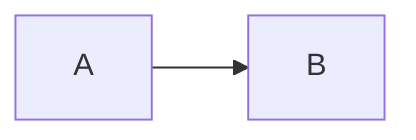

---
{"dg-publish":true,"permalink":"/02-resources/notes/unicast/","tags":["netzwerk"],"noteIcon":"","updated":"2024-07-04T11:38:16.825+02:00"}
---

> Ein Sender adressiert einen Empfänger. 

```mermaid
graph LR
A --> B
```
