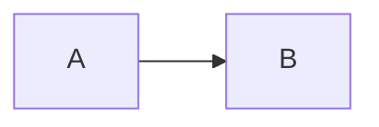

---
{"dg-publish":true,"permalink":"/02-resources/notes/unicast/","tags":["informatik/netzwerk"],"noteIcon":"","updated":"2025-10-29T12:59:10.986+01:00"}
---

> Ein Sender adressiert einen Empfänger. 

