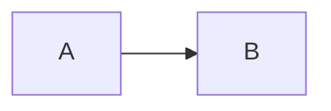

---
{"dg-publish":true,"permalink":"/02-resources/notes/unicast/","tags":["netzwerk"],"noteIcon":"","updated":"2025-09-05T10:12:32.454+02:00"}
---

> Ein Sender adressiert einen Empfänger. 

```mermaid
graph LR
A --> B
```
