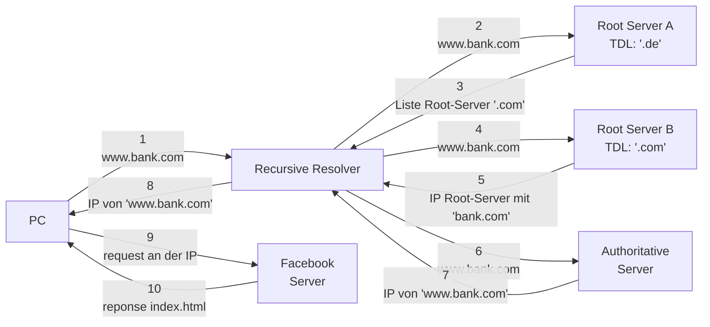

---
{"dg-publish":true,"permalink":"/wiki/dns/","tags":["informatik/netzwerk"],"noteIcon":"","updated":"2026-07-19T03:56:26.000+02:00","dg-note-properties":{"Created":"2023-07-30 19:50","Path":"Notes","Reference":"https://root-servers.org/","aliases":["Domain Name Server"],"tags":["informatik/netzwerk"]}}
---

> [[wiki/Domain\|Domain]] Name System

Wenn wir beispielsweise eine URL in unseren Browser eingeben, wie zum Beispiel [www.haus-meyer.bank.com](http://www.haus-meyer.bank.com), werden wir direkt zur Website der Bank Haus Meyer weitergeleitet. Der Prozess, der das möglich macht, ist jedoch nicht so simpel, wie es scheint.

Um zu verstehen, was hinter den Kulissen passiert, musst du wissen, was [[wiki/Domain\|Domain]] Name Server (DNS) sind und wie der gesamte Ablauf von Anfragen (Requests) und Antworten (Responses) funktioniert.

<mark style="background: #BBFABBA6;">haus-meyer</mark>.<mark style="background: #FFF3A3A6;">bank</mark>.<mark style="background: #FF5582A6;">com</mark>

<mark style="background: #BBFABBA6;">[[wiki/Subdomain\|Subdomain]]</mark>
<mark style="background: #FFF3A3A6;">[[wiki/Domain\|Domain]]</mark>
<mark style="background: #FF5582A6;">[[wiki/TLD\|TLD]]</mark>

{ #1245f6}

Wie du es sehen kannst, macht der Recursive Resolver die ganze Arbeit. Um das alles schneller zu machen, wurde das [[wiki/TTL Cache\|TTL Cache]] zwischen den Root Servers und dem Recursive Resolver eingefügt.

### Beispiel 
Um das besser zu verstehen, lass uns die Website [uol](https://www.uol.com.br/) (https://www.uol.com.br/) besuchen. So läuft es ab:
>[!summary] 
>- Mein Browser schickt einen Request an den Resolver in Frankfurt
> - Dieser schickt einen Request an den Root-Server (am nächsten) mit der Endung '.br'
> - Er kriegt zurück eine Liste mit allen Root-Servers, die '.br' [[wiki/TLD\|TLD]] haben
> - Der Resolver schickt erneut einen Request, aber dieses Mal an den Authoritative Server, und dieser schickt die [[02 - RESOURCES/Notes/IP\|02 - RESOURCES/Notes/IP]] von uol zurück
> - Sobald der Recursive Resolver das erhält, schickt er es an meinen Browser zurück
> - Mein Browser muss jetzt nur einen Request an diese [[02 - RESOURCES/Notes/IP\|02 - RESOURCES/Notes/IP]] schicken und auf den Response warten

### Zone & autoritative Antwort

- Eine **Zone** = der Verwaltungsbereich eines Nameservers. Bekommt z.B. `it.company.com` eigene NS-Einträge, ist das eine ==eigene Zone==.
- **Autoritativ** = die Antwort kommt vom zuständigen Server (verbindlich). Kommt sie aus dem **Cache**, ist sie nicht-autoritativ — `nslookup` zeigt dann „Nicht autorisierende Antwort".
- Die Record-Typen (A, AAAA, NS …) stehen in [[wiki/DNS-Einträge\|DNS-Einträge]].