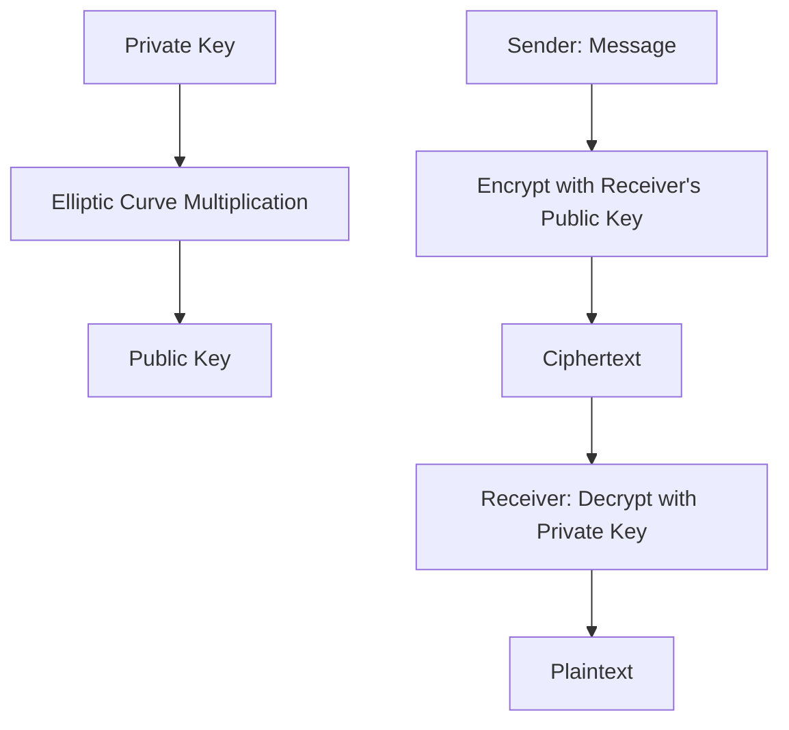

---
{"dg-publish":true,"permalink":"/wiki/ecc/","tags":["ausbildung/gfn/ap1/vorbereitung","informatik/sicherheit/it-sicherheit","informatik/sicherheit/kryptografie"],"noteIcon":"","updated":"2026-07-02T15:37:49.215+02:00","dg-note-properties":{"aliases":["Elliptic Curve Cryptography"],"created_date":"2025-03-18","links":null,"tags":["ausbildung/gfn/ap1/vorbereitung","informatik/sicherheit/it-sicherheit","informatik/sicherheit/kryptografie"]}}
---

>Es ist ein Asymmetrische Verschlüsselungsverfahren, das auf der [[wiki/Mathe\|Mathematik]] elliptischer Kurven basiert.

> > ECC bietet bei kürzeren Schlüsseln eine vergleichbare Sicherheit wie andere Verfahren (z. B. [[wiki/RSA\|RSA]]), ist dabei jedoch ressourcenschonender.  
> > Wird häufig in mobilen Geräten, SSL/TLS und modernen Verschlüsselungsprotokollen eingesetzt.

**Vorteile von ECC:**

- Kürzere Schlüssel bei gleicher Sicherheit wie z. B. [[wiki/RSA\|[[R]]SA]]
- Schneller bei [[wiki/Verschlüsselung\|Verschlüsselung]] und Entschlüsselung
- Geringerer Ressourcenverbrauch (z. B. CPU, Speicher)

**Nachteile von ECC:**

- Komplexere Implementierung
- Anfälliger für Implementierungsfehler
- Lizenzprobleme bei manchen Kurven (z. B. vor NIST P-256)
